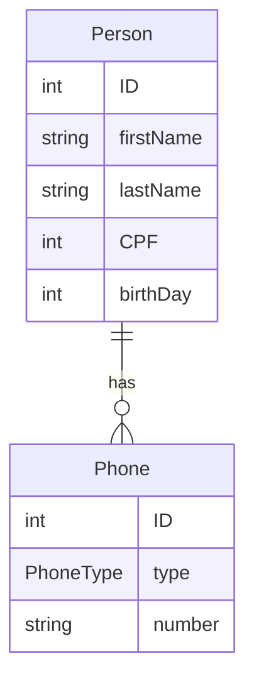

# People Management REST API

Heroku project name: **_ourpeopleapi-live_**
___
## Database ERM


___
## Verbos HTTP

|URI|Method|Description|Request Stream|Response Stream|Status Code Returned|
|---|---|---|---|---|---|
|/people|GET|All people in the system|n/a|**Person** collection|200/404|
|people/{id}|GET|Get specific **person**|n/a|**Person**|200/404|
|/people|POST|Creates a new entity Person in the system. Expects a representation of the person in the body|**Person** without the id specified|**Person**|201/404|
|people/{id}|PUT|Modifies a **person** resource|Person|n/a|200/404|
|people/{id}|DELETE|Deletes a **person** resource|n/a|n/a|200/404|


___
### Notes
GenerationType.IDENTITY, na anotação @GeneratedValue,
atribui ao BD a geração do id com estratégia incremental (IDENTITY).
```java
@GeneratedValue(strategy = GenerationType.IDENTITY)
```
```java
public interface PersonRepository extends JpaRepository<Person, Long>
``` 
onde Person é a classe/entidade
a ser mapeada e Long é o tipo da chave primária.
A interface JpaRepository contém todos os métodos e contratos de um CRUD.

**@Autowired** 'solicita' ao Spring a injeção de um tipo Repository.

**@RequestBody** informa que o método receberá uma requisição do tipo Person
em JSON.

Continuar da parte 11 (commit para a branch update_feature já feito)
