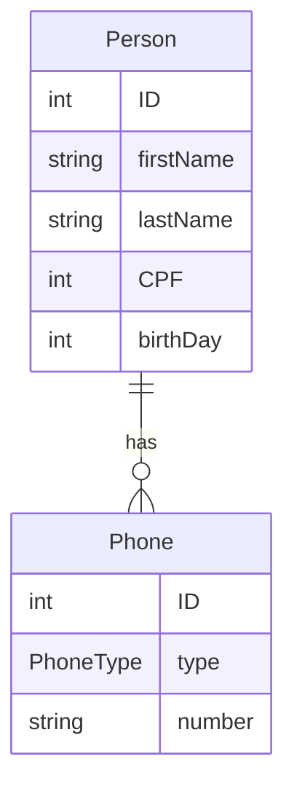

Heroku project name <br>
ourpeopleapi-live


GenerationType.IDENTITY, na anotação @GeneratedValue,
atribui ao BD a geração do id com estratégia incremental (IDENTITY).
```java
@GeneratedValue(strategy = GenerationType.IDENTITY)
```
```java
public interface PersonRepository extends JpaRepository<Person, Long>
``` 
onde Person é a classe/entidade
a ser mapeada e Long é o tipo da chave primária.
A interface JpaRepository contém todos os métodos e contratos de um CRUD.

**@Autowired** 'solicita' ao Spring a injeção de um tipo Repository.

**@RequestBody** informa que o método receberá uma requisição do tipo Person
em JSON.

