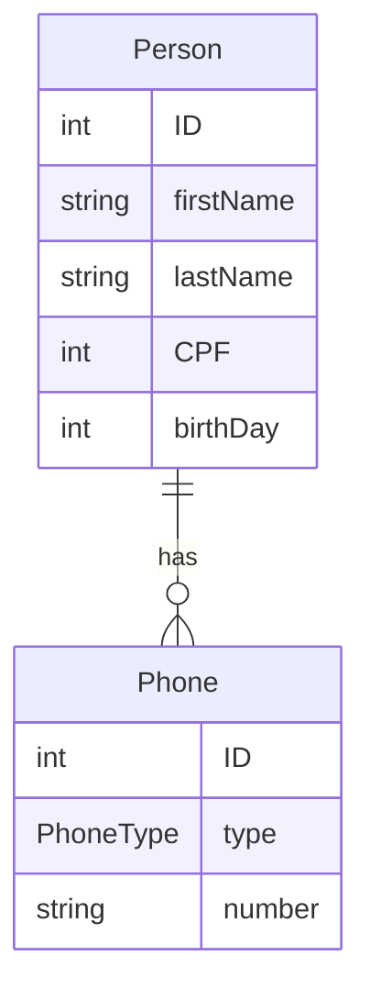

Heroku project name <br>
ourpeopleapi-live


GenerationType.IDENTITY, na anotação @GeneratedValue,
atribui ao BD a geração do id com estratégia incremental (IDENTITY).
```java
@GeneratedValue(strategy = GenerationType.IDENTITY)
```